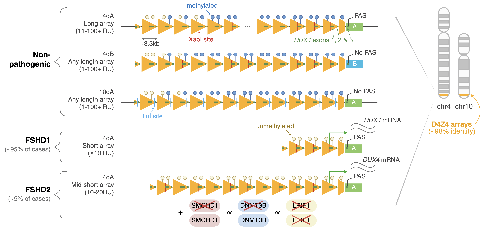
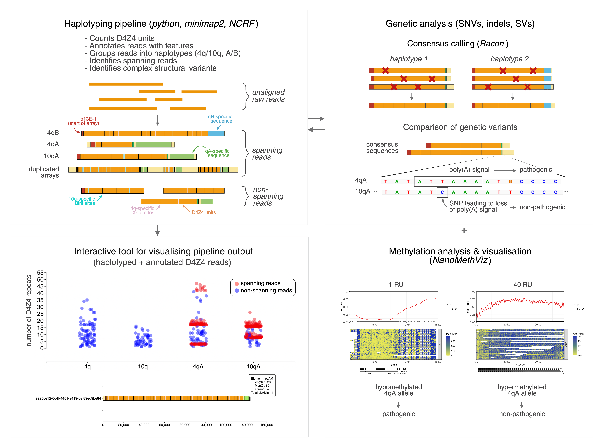

# D4Z4End2End

D4Z4End2End is an all-in-one, long-read based pipeline for the complete genetic and epigenetic characterisation of D4Z4 macrosatellite arrays.

It accompanies our preprint [D4Z4End2End: complete genetic and epigenetic architecture of D4Z4 macrosatellites in FSHD, BAMS and reference cohorts](https://doi.org/10.1101/2025.04.24.25326320), available on medRxiv.

## Background
The D4Z4 macrosatellite array is found at the telomeric ends of chromosome 4 (4q35) and chromosome 10 (10q26), and contains anywhere between 1 to 100+ 3.3kb tandem repeat units. Each D4Z4 unit contains a partial copy of the *DUX4* gene, and a full length *DUX4* is present at the end of the array.

Epigenetic dysregulation of the D4Z4 array on chromosome 4 leads to ectopic *DUX4* expression in muscle cells and causes fascioscapulohumeral muscular dystrophy (FSHD), the third-most common muscular dystrophy worldwide.

Despite the D4Z4 macrosatellite's relevance to human health, many aspects of its genetic and epigenetic architecture remain poorly understood. This is because its size and repetitiveness make it particularly hard to study via conventional approaches, such as short-read sequencing and automated assembly.

<strong>Structure of the D4Z4 macrosatellite & pathogenesis of FSHD:</strong>

## D4Z4End2End overview
D4Z4End2End is an all-in-one, long-read based pipeline for exploring the genetic and epigenetic architecture of full-length D4Z4 arrays. Due to the D4Z4 array's size, it works optimally with ultra-long read sequencing (see our [preprint](https://doi.org/10.1101/2025.04.24.25326320) for details).

D4Z4End2End:
- Processes D4Z4-containing raw reads to annotate them with their features and assign them to haplotypes
- Identifies reads that span the full D4Z4 array
- Generates consensus sequences from spanning reads (using [Racon](https://github.com/lbcb-sci/racon))
- Produces array-wide 5mCG methylation plots and methylation statistics (using [NanoMethViz](https://github.com/Shians/NanoMethViz))

D4Z4End2End includes an interactive html visualisation tool for exploring the annotated raw reads and consensus sequences.

<strong>Overview of D4Z4End2End pipeline:</strong>

## Installation & Usage

See the `Tutorial.md` file for instructions on how to install and run the pipeline.

## Acknowledgements

We thank all of the authors and participants in the [D4Z4End2End](https://doi.org/10.1101/2025.04.24.25326320) project for their contributions to the study. For the D4Z4End2End pipeline, particular acknowledgements go to Ayush Semwal and Quentin Gouil for the original version of the D4Z4_haplotyping.py script and interactive visualisation tool, and to Shian Su as the creator of NanoMethViz.