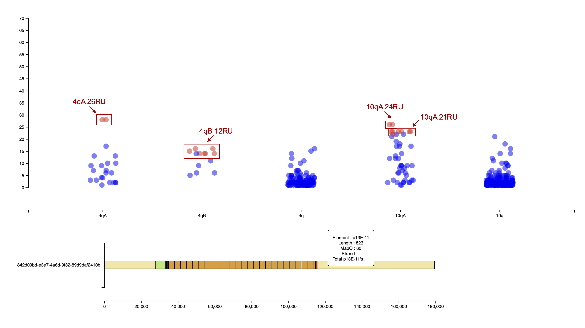
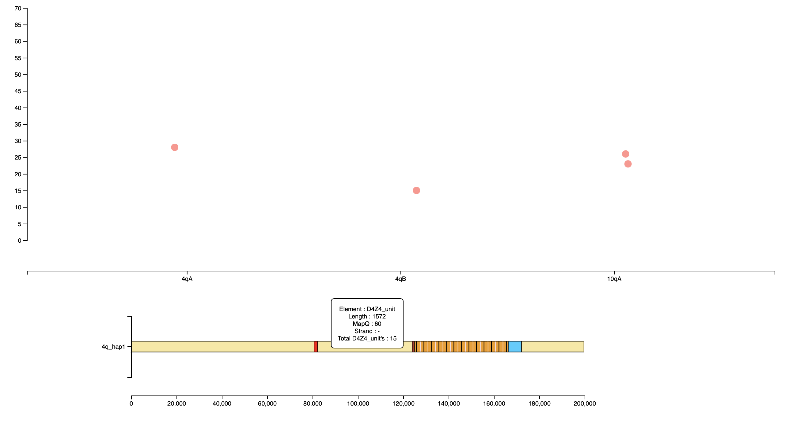
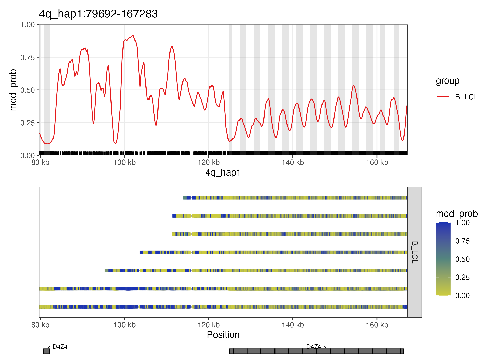

# D4Z4End2End Tutorial

## Installation

Install D4Z4End2End by running the following:

```bash
git clone https://github.com/lucindaxiao/D4Z4End2End.git
cd D4Z4End2End

conda env create -f environment.yml
conda activate D4Z4End2End
```

The D4Z4End2End conda environment handles the following dependencies:
- minimap2, samtools, bedtools, ncrf, seqtk, seqkit, racon
- Python 3 (3.13.3), jenkspy
- R 4.4.3, NanoMethViz, dplyr

Additionally, you will need:
- Python 2 (tested on 2.7.18) for NCRF, used in D4Z4_haplotyping.py

## Running the pipeline

D4Z4End2End uses three scripts:
1. `D4Z4_haplotyping.py`: for haplotyping and annotation of D4Z4 reads/reference sequences
2. `D4Z4_alleles.py`: for processing of spanning reads for each allele and consensus calling
3. `D4Z4_methylation.R`: for methylation analysis and plotting

To demonstrate how to run D4Z4End2End, we will use ONT long-read sequencing data for the B-lymphoblastoid cell line HG02185, from the 1000 Genomes Project ONT Sequencing Consortium ([1KGP-ONT](https://millerlaboratory.com/1000G-ONT.html)) (https://s3.amazonaws.com/1000g-ont/index.html).

If your sequencing data is in `BAM` format and pre-aligned to CHM13v2.0, extract the regions that align to 4q35 and 10q26 before inputting into the pipeline.

```bash
samtools view -h HG02185-ONT-chm13-R9-LSK110-guppy-sup-5mC chr4:193343275-193574945 chr10:134545319-134758134 -o HG02185_4q_10q.mod.bam
```

We will also need the reads in `FASTQ` format to input into `D4Z4_haplotyping.py`.

```bash
samtools fastq HG02185_4q_10q.mod.bam > HG02185_4q_10q.fq
```

You can find the following files in the `tutorial_files` directory:
- `HG02185_4q_10q.fq`
- `HG02185_4q_10q.mod.bam`

(The tutorial_files directory also contains the expected output from running the code below.)

You should run the pipeline from the `D4Z4End2End` directory. Your output files will be written to a new `output` subdirectory.

### Step 1: Annotating and haplotyping raw D4Z4 reads
   
   We will first process the raw sequencing data to identify, haplotype and annotate D4Z4-containing 4q and 10q reads.

   Run the following:

   ```bash
   FASTQ=tutorial_files/HG02185_4q_10q.fq
   RAW_HAPLO_OUTDIR=HG02185_haplotyping_raw_reads

   python2 scripts/D4Z4_haplotyping.py -i $FASTQ -o $RAW_HAPLO_OUTDIR
   ```

   Python2 is needed to run NCRF.

   **Input**:
   - `FASTQ` file containing raw 4q and 10q reads. Ideally, the FASTQ should only include 4q and 10q reads to decrease processing time, however the pipeline can also process whole-genome sequencing data.

   **Output**:
   
   The two most important files in the haplotyping output directory are:
   - `haplotypes.txt`: contains the read IDs for the D4Z4-containing 4q and 10q reads, with their haplotypes, number of D4Z4 units, and whether they span the full D4Z4 array
   - `reads_features.txt`: contains the feature annotations for each D4Z4-containing 4q/10q read

   To explore the output interactively, navigate to the output directory and run:
   ```bash
   python3 -m http.server 8000
   ```

   Go to http://localhost:8000 on your web browser and open the `haplotypes.html` file. You should see something like the following:

   

   Each dot is a raw read, plotted based on its haplotype (x-axis) and number of D4Z4 units (y-axis). Red dots are reads that span the whole D4Z4 array, and blue dots are non-spanning reads.

   Spanning reads can be used to identify distinct 4q and 10q alleles. Some extra annotations have been added to the screenshot to point out the four D4Z4 alleles that were identified for HG02185.
   
   You can mouse over the individual dots to display the annotated raw read underneath the main plot. Mousing over the features in the raw read displays a pop-up with more information about the feature alignment. Here we have moused over one of the 10qA 24RU dots, and the p13E-11 feature in the raw read.

### Step 2: Processing spanning reads and generating consensus sequences for D4Z4 alleles

   Using the interactive tool or `haplotypes.txt`, identify how many 4q and 10q alleles had at least one spanning read. For HG02185, there are spanning reads for two 4q alleles and two 10q alleles.

   We will now use these spanning reads to create a reference `FASTA` (either a raw read or a consensus sequence) and aligned `BAM` file for each allele.

   ```bash
   BAM=tutorial_files/HG02185_4q_10q.mod.bam
   ALLELE_OUTDIR=HG02185_alleles

   python3 scripts/D4Z4_alleles.py -i $RAW_HAPLO_OUTDIR/haplotypes.txt -b $BAM -o $ALLELE_OUTDIR -4q 2 -10q 2
   ```

   **Input**:
   - `BAM` file containing 4q and 10q reads. If you would like to perform methylation analysis, this should be a modBAM file containing 5mCG calls. You can still run this step if you don't have 5mCG information, but won't be able to run Step 4.

   **Output**:
   - `D4Z4_alleles.fa`: contains a reference sequence for each 4q and 10q allele. This will either be the Racon consensus sequence, or a raw spanning read (if there are <3 spanning reads or the script is run with --no_consensus).
   - `D4Z4_alleles.bam`: spanning reads aligned to their respective alleles in D4Z4_alleles.fa

   For HG02185, consensus sequences were generated for the 4qB 12RU and 10qA 21RU alleles, but not for the 4qA 26RU and 10qA 24RU alleles since they each only had two spanning reads.


### Step 3: Annotating reference sequences for D4Z4 alleles
   
   Feed the reference sequences for the D4Z4 alleles (`D4Z4_alleles.fa`) back into the haplotyping pipeline.
   
   ```bash
   REF_HAPLO_OUTDIR=HG02185_haplotyping_ref_seqs

   python2 scripts/D4Z4_haplotyping.py -i output/$ALLELE_OUTDIR/D4Z4_alleles.fa -o $REF_HAPLO_OUTDIR
   ```

   You can explore the annotated reference sequences for each allele as in Step 1.

   

### Step 4: Allele-specific, array-wide D4Z4 methylation analysis using NanoMethViz

   We will now generate methylation plots and methylation statistics for each D4Z4 allele.

   Run the following:
   
   ```bash
   SAMPLE=HG02185
   GROUP=B_LCL
   METHY_OUTDIR=HG02185_methylation

   Rscript scripts/D4Z4_methylation.R -s $SAMPLE -g $GROUP -a $REF_HAPLO_OUTDIR/reads_features.txt -b $ALLELE_OUTDIR/D4Z4_alleles.bam -o $METHY_OUTDIR
   ```

   **Input**:
   - `D4Z4_alleles.bam` from Step 3

   **Output**:
   - Mean 5mCG probabilies and 5mCG rates for each allele (in `*5mCperRU.tsv` files)
   - Mean 5mCG probabilies and 5mCG rates for each allele (in `[SAMPLE]_5mC_fullD4Z4.tsv`)
   - Smoothed methylation probability and single-molecule methylation plots for each allele (`[SAMPLE]*.png` files)
   
Here is the NanoMethViz plot for the HG02185 4qB 12RU alelle:



The grey bars on the smoothed methylation signal plot (top) correspond to the positions of *DUX4* exons. For the 4qB 12RU allele, two of the spanning reads also extend to the inverted partial D4Z4 unit that is found ~42kb upstream of 4q D4Z4 arrays.

Compare this to the methylation plots for the other alleles. You will notice higher methylation levels for longer arrays, and smoother methylation patterns for alleles with more spanning reads.

(*Note:* For simplicity, for this pipeline we only use the spanning reads to generate consensus sequences and for methylation plotting. You can look at the non-spanning reads as well, e.g. by mapping them against their corresponding allele in D4Z4_alleles.fa for plotting.

If you'd like to learn more about using NanoMethViz for plotting and methylation analysis, have a look at our workflow article ['A streamlined workflow for long-read DNA methylation analysis with NanoMethViz and Bioconductor'](https://f1000research.com/articles/13-1243).)

<strong>Congratulations! You've completed the D4Z4End2End pipeline.<strong>